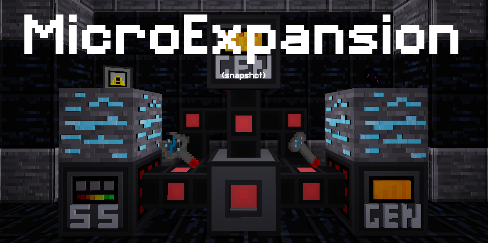

MicroExpansion - ME [microexpansion]
======================================

* **Licence:** Code: MIT (see LICENSE), Media: CC-BY-SA 3.0

When you really get into a survival world, you typically end up with a lot of items, like a ton of items.
Sometimes literally.  
But with that huge amount of resources, comes something annoying and typically unwanted: chests.  
Well, of course. You have to have chests to store items, but no biggie, it's just chests.  
Then your storage room starts to grow, soon you have 25 chests, then 50, then 100.  
When management gets too hard. MicroExpansion, is the solution.

Forked and continued by theFox6 from the original mod by octacian.
[Original Repository](https://github.com/octacian/microexpansion)
Original license: MIT
This mod was inspired by Applied Energistics 2 for Minecraft  
MicroExpansion introduces many new nodes and items giving the player simpler and more compact ways to store thousands of items inside of a single ME drive.
